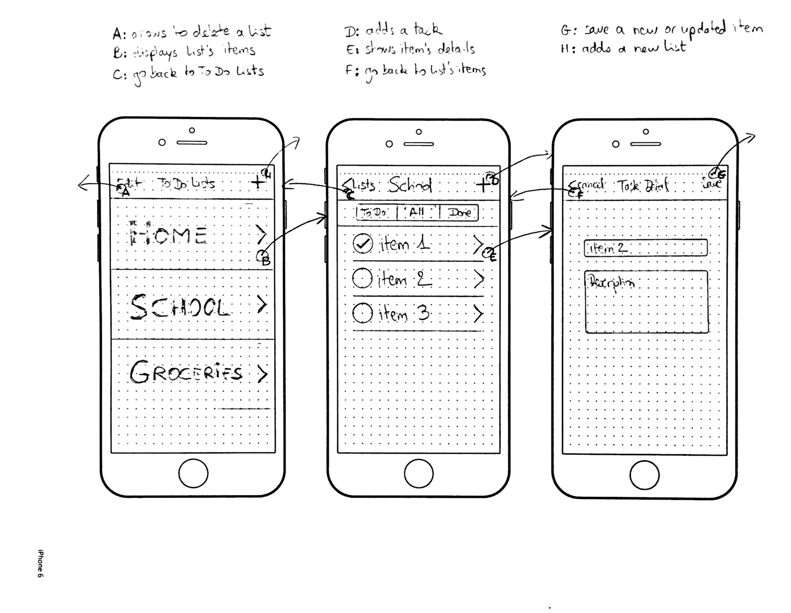
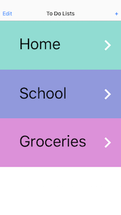
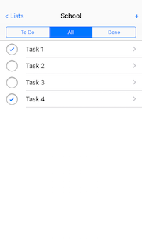
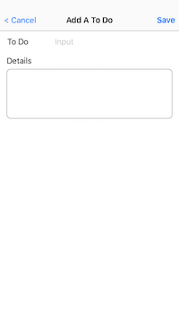

# A To Do List app

Check the Pivotal Tracker board [here](https://www.pivotaltracker.com/n/projects/1790653)

## About the app
This app is a To Do List made with Swift 3.0 on Xcode-beta6. It uses TableView controllers to display the collection of To Do Lists, and To Do Items. It display correctly in both landscape and portrait orientations, so you can always enter To Do items if you are in an environment that doesn't allow you to use your phone in portrait mode. Like if your iPhone is taller than you in portrait mode.

You can create and edit to-do lists, and add to-do items to these lists. Swipe to delete allows to definitely remove an item from a list, or a whole list. When you are done with an item, a tap on the check button will mark it as done. The item list can display `To Do`, `All` and `Done` items, thanks to a segmented control at the top of the list.  

## Prototypes

### Paper

### Sketch

## Screenshots

  